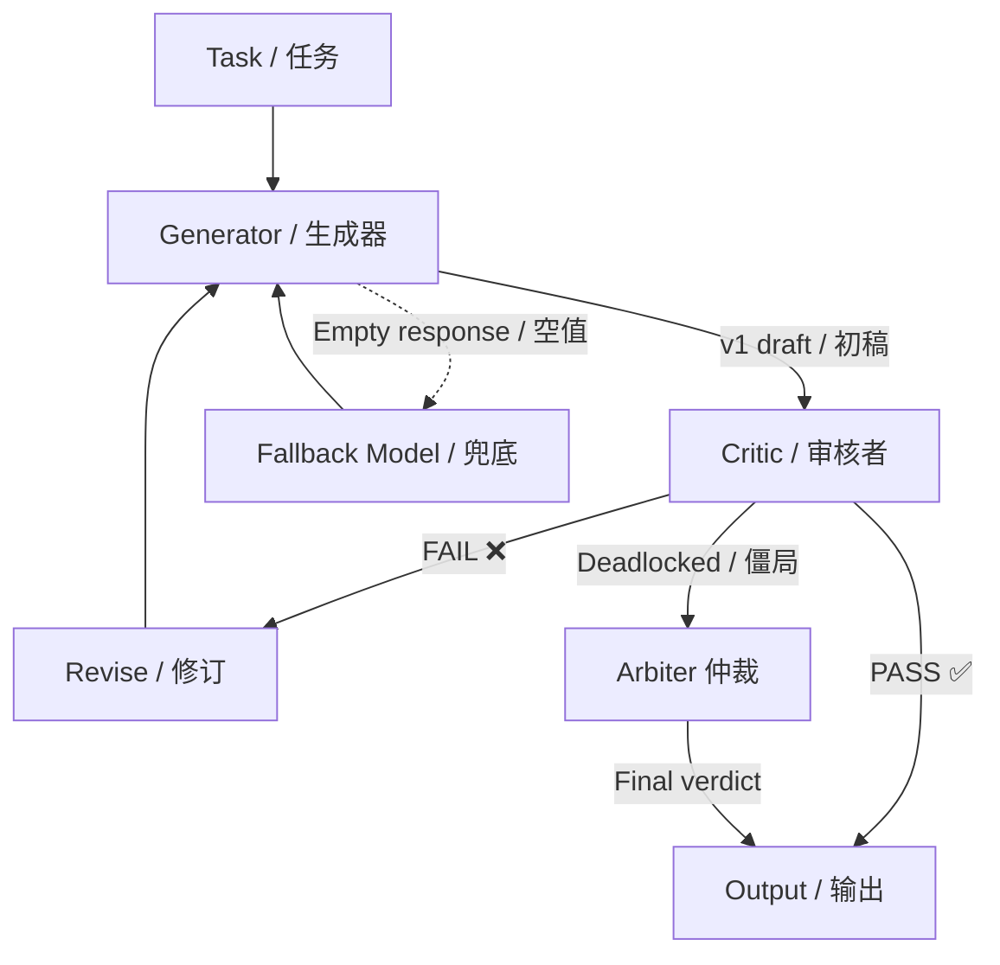

# Adversarial Solver / 对抗式求解器

[](https://pypi.org/project/adversarial-solver/)
[](https://pypi.org/project/adversarial-solver/)
[](LICENSE)
[](https://www.python.org/)

> **Two AIs argue until your content is right.**
> Generator writes. Critic attacks. Loop until PASS.
> Built for teams tired of fixing AI-generated slop.

> **两个 AI 互相吵架，直到你的内容合格。**
> Generator 产出，Critic 攻击，不通过就修订，循环直到 PASS。
> 为厌倦给 AI 内容修修补补的团队而建。

## Why? / 为什么？

Writing content is easy. Writing *correct* content is hard.
写内容容易，写"对"的内容很难。

Adversarial Solver makes two (or three) LLMs keep each other in check:
对抗式求解器让两个（或三个）LLM 互相制衡：

- **Generator** produces the content / 产出内容
- **Critic** reviews it against your rules / 按你的规则审核
- If it fails, the Generator revises / 不通过就修订
- Loop until the Critic (or **Arbiter**) says "PASS" / 循环直到通过

The result: content that has been through a quality-control pipeline *before* it reaches human eyes.
结果：内容在到达人眼之前，已经跑完一条质检流水线。



### See It In Action / 30 秒看完

```bash
$ adversarial-solver solve -t "Write a landing page headline for our tea brand." -d marketing

[Generator · gpt-4.1] Drafting v1...
[Critic · claude-sonnet-4-6] ❌ Uses banned word 'premium' (rule: exaggeration)
[Generator · gpt-4.1] Revising v2...
[Critic · claude-sonnet-4-6] ❌ Missing CTA
[Generator · gpt-4.1] Revising v3...
[Critic · claude-sonnet-4-6] ✅ PASS (round 3)

Output: "Tea that knows when to stop. Take A Beat."
```

## Key Features / 核心功能

- **Dual-Model Adversarial Loop / 双模型对抗循环** — Generator → Critic → Revise → PASS
- **Optional Arbiter / 可选仲裁者** — 3rd model breaks Generator-Critic deadlocks / 第三模型打破僵局
- **Auto Mode Detection / 自动模式检测** — Short-context models (e.g. MiniMax M3 at 8K) auto-trigger segmented mode / 短上下文模型自动分段
- **Hard Empty-Response Prevention / 空值硬约束** — Built-in retry + temperature escalation + automatic fallback model switching / 重试 + 升温 + 兜底模型切换
- **Tone Checker / 调性检查器** — Hard-filter banned words with configurable YAML rules / 可配置违禁词硬过滤
- **Segmented Mode / 分段模式** — Long-form content split into outline → sections → assembly / 长内容自动拆分为大纲→逐节→拼装
- **Config-Driven / 配置驱动** — YAML departments and rules; no code changes needed / 不改代码，只改 YAML
- **Multi-Provider / 多模型支持** — Any LiteLLM-supported model (OpenAI, Anthropic, DeepSeek, MiniMax, Gemini, local models)
- **Full Audit Trail / 完整审计日志** — Every round logged; results archived as JSON / 每轮记录，归档为 JSON

## Quick Start / 快速开始

```bash
# Install / 安装
pip install adversarial-solver

# Create config templates / 生成配置模板
adversarial-solver init

# Edit config/departments.yaml and config/rules.yaml / 编辑配置文件
# Add your API keys to config/.env / 填入 API Key

# Run your first adversarial solve (mode auto-detected) / 跑第一次对抗求解
adversarial-solver solve -t "Write a product description." -d marketing
```

## How It Works / 工作原理

```
Task / 任务 → Generator (v1) → Critic reviews / 审核
                    ↑            ↓
                    │      PASS? ─── Yes → Output / 输出
                    │         │
                    └─ Revise / 修订 ← No
                    │         │
                    │   Deadlocked? / 僵局? → Arbiter (optional / 可选) → Final verdict / 最终裁决
                    │
               [Empty response? / 空值? → Retry / 重试 → Fallback model / 兜底模型]
```

### Auto Mode Detection / 自动模式检测

The solver automatically detects whether to use **standard** or **segmented** mode based on model context windows:
求解器根据模型上下文窗口自动判断用 standard 还是 segmented 模式：

| Scenario / 场景 | Detection / 检测 | Behavior / 行为 |
|----------|-----------|----------|
| Both models 128K+ context / 两模型都 128K+ | → standard | Single-pass generation / 单次生成 |
| One model ≤16K context (e.g. M3) / 一个模型 ≤16K | → segmented | Auto-split into outline + sections / 自动分段 |
| Manual override / 手动覆盖 | `-m standard` or `-m segmented` | User choice respected / 尊重用户选择 |

Run `adversarial-solver info -m MiniMax/M3` to check a model's context window.
运行 `adversarial-solver info -m MiniMax/M3` 查看模型上下文窗口。

## Configuration / 配置

### departments.yaml — Define your review teams / 定义审查部门

```yaml
departments:
  marketing:
    name: "Marketing"                            # Department name / 部门名称
    primary_model: "openai/gpt-4.1"             # Generator / 生成器
    reviewer_model: "anthropic/claude-sonnet-4-6" # Critic / 审核者
    arbiter_model: ""                            # Optional 3rd model / 可选仲裁
    fallback_model: ""                           # Fallback on empty / 空值兜底
    tone_checker: true                           # Enable tone checker / 启用调性检查
```

### rules.yaml — Define your banned words / 定义违禁词

```yaml
banned_words:
  medical:                        # Medical claims / 医疗宣称
    - "cure"
    - "treat"
    - "heal"
  exaggeration:                   # Exaggerated language / 夸张用语
    - "premium"
    - "luxury"
    - "revolutionary"
```

### constitution.md — Define your principles / 定义品牌原则

Write your brand guidelines, core principles, and hard rules. The Generator references this for every task.
写入你的品牌准则、核心原则和硬性规则。Generator 每次执行任务时都会参考。

## CLI Reference / 命令行参考

```bash
# Single task (mode auto-detected) / 单任务（自动检测模式）
adversarial-solver solve -t "Write a landing page headline." -d marketing

# Force segmented mode / 强制分段模式
adversarial-solver solve -t "Generate a 50-page report." -d editorial -m segmented

# Tone check on existing text / 对已有文本做调性检查
adversarial-solver check-tone -t "This product cures everything."

# Check model context window / 查看模型上下文窗口
adversarial-solver info -m MiniMax/M3

# Create config templates / 创建配置模板
adversarial-solver init -p my_project/config
```

## Python API

```python
from adversarial_solver import adversarial_solve

result = adversarial_solve(
    task="Write a product description.",       # Task / 任务
    dept="marketing",                          # Department / 部门
    max_rounds=3,                              # Max review rounds / 最大审核轮次
    config_path="my_config",                   # optional / 可选
    mode=None,                                 # None = auto-detect / 自动检测
)

print(result["final"])          # The approved output / 最终通过的输出
print(result["status"])         # "PASS" or "PENDING_REVIEW" / 通过或待人工审核
print(result["total_rounds"])   # How many review rounds / 审核轮次
print(result.get("tone_check")) # Tone checker results / 调性检查结果
```

### Batch Processing / 批量处理

```python
from adversarial_solver import batch_solve

results = batch_solve([
    {"task": "Write a homepage headline.", "dept": "marketing"},
    {"task": "Write a privacy policy summary.", "dept": "legal"},
])
print(f"{results['passed']}/{results['total']} passed")
```

## Real-World Use Cases / 实际应用场景

| Use Case / 场景 | Department / 部门 | Typical Mode / 模式 |
|----------|-----------|-------------|
| Brand copy & ads / 品牌文案·广告 | marketing | standard |
| Legal/regulatory docs / 法律合规文档 | legal | standard |
| Code review / 代码审查 | engineering | standard |
| Blog posts / 博客文章 | editorial | standard |
| Competitive analysis (50+ pages) / 竞品分析 | editorial | auto-segmented |
| Strategy documents / 策略文档 | marketing | auto-segmented |

## FAQ

**Q: Do I need two different models? / 必须用两个不同的模型吗？**
A: No. Same model works — the Critic gets a different system prompt that makes it behave as a reviewer. / 不需要。同一个模型也可以——Critic 用不同的 system prompt 就会以审核者身份工作。

**Q: When do I need the Arbiter (3rd model)? / 什么时候需要第三个模型？**
A: When Generator and Critic disagree for multiple rounds and you want an automatic tie-breaker. Most cases, 2 models are enough. / Generator 和 Critic 多轮僵持不下时，Arbiter 自动裁决。大多数情况两个模型够了。

**Q: What happens if a model returns empty? / 模型返回空值怎么办？**
A: The solver retries with temperature escalation. If still empty, it switches to `fallback_model` (if configured). If fallback also fails, the task is archived for human review. / 先重试 + 升温。还空就切 fallback_model。都失败则归档待人工介入。

**Q: How does auto mode detection work? / 自动模式检测怎么工作？**
A: The solver checks both models' context windows (via built-in lookup table). If either model has ≤16K context, it auto-switches to segmented mode. / 检查两个模型的上下文窗口，任一 ≤16K 就自动切分段模式。

**Q: What if my model isn't in the context window lookup table? / 模型不在查表里？**
A: Unknown models default to 128K (safe for most modern LLMs). You can submit a PR to add your model. / 未知模型默认 128K。欢迎提 PR 添加。

**Q: Can I use local models? / 能用本地模型吗？**
A: Yes — via LiteLLM's support for Ollama, vLLM, and other local providers. / 可以，通过 LiteLLM 对接 Ollama/vLLM 等。

**Q: Does the tone checker work with non-English text? / 调性检查支持非英文吗？**
A: Yes. Banned words are case-insensitive substring matches. Add any language words to `rules.yaml`. / 支持。违禁词是大小写不敏感的子串匹配，任何语言都行。

## Requirements / 环境要求

- Python 3.10+
- API key for at least one LLM provider / 至少一个 LLM 服务商的 API Key

## Contributing / 贡献

See / 参见 [CONTRIBUTING.md](CONTRIBUTING.md).

## License / 许可证

MIT — see / 参见 [LICENSE](LICENSE).
